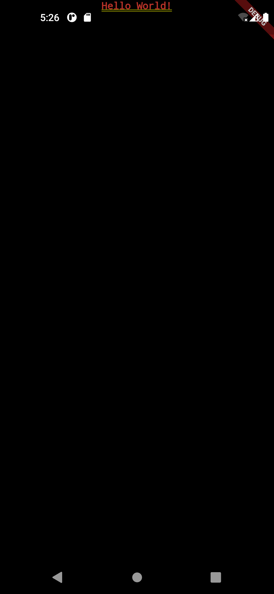
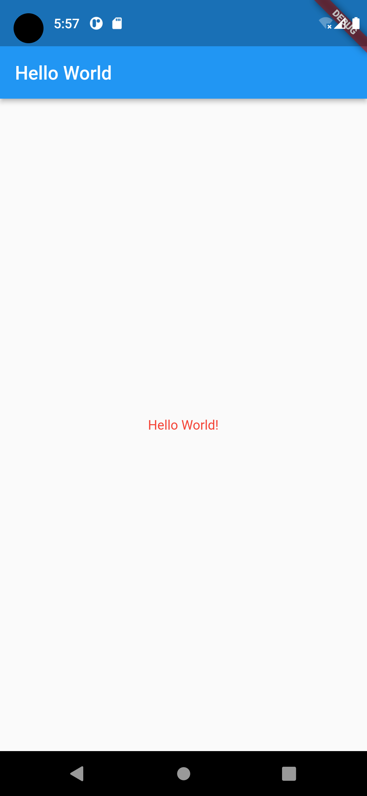
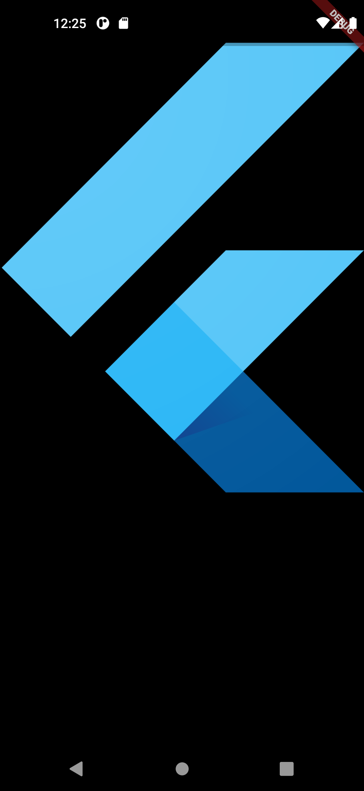
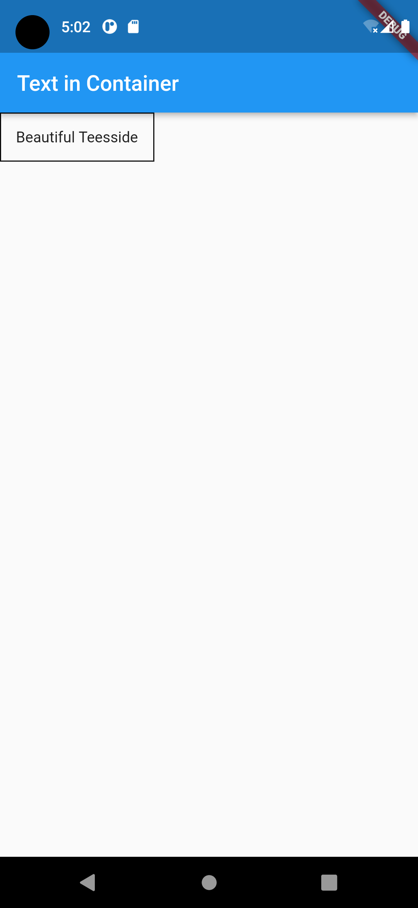
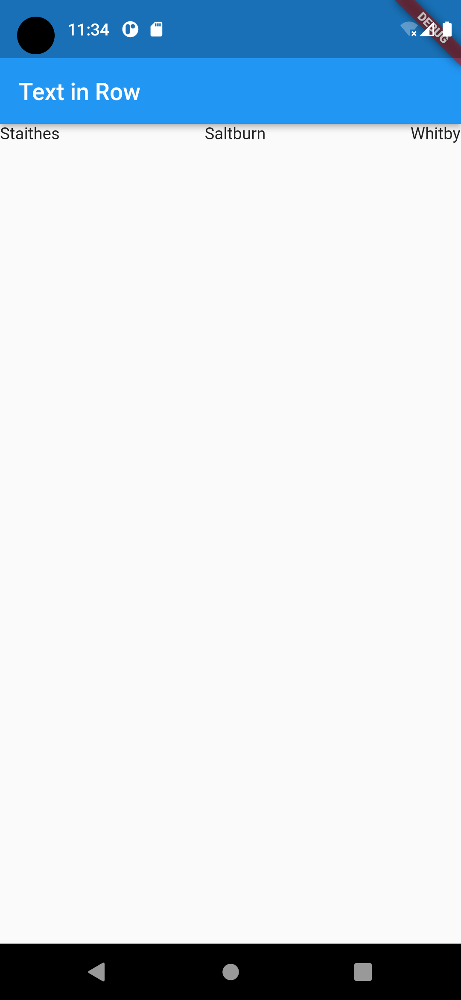

# Flutter for Beginners (2nd ed), Section 2, Chapter 5

- By Thomas Bailey, Alessandro Biessek, Trevor Wills
- October, 2021
- ISBN 978-1-80056-599-9

Section 2: The Flutter User Interface &emdash; Everything is a Widget

# Chapter 5: Widgets &emdash; Building Layout in Flutter

- Technical requirements
- Stateful/Stateless widgets
  - `StatelessWidget`
  - `StatefulWidget`, `State`
  - `InheritedWidget`
  - The widget key property
- Built-in widgets
  - Basic widgets
    - `Text`, `Image`
  - Material Design and iOS Cupertino widgets
    - Button, Scafflod, Dialog, TextField, Selection, Date/Time pickers
  - Layouts
    - `Container`, `Center`, `Align`, `Padding`, `Row`, `Column`, `Stack`, `ListView`, `GridView`
- Streams

<!--- ///////////////////////////////////////////////////////////////////// --->
## Stateful/Stateless widgets

<!--- ================================================================= --->
### Stateless widgets

Stateless widgets do not have a state; that is, they do not change by themselves through an internal action or behavior. Insted, they are changed by external events on parent widgets in the widget tree.

The parent widget instantiates the child stateless widget and passes a set of properties during the instantiation. The child widget can only receive these properties from the parent widget and will not chage them by itself.

In terms of code, this means that stateless widgets only have final properties defined during construction, and these properties can only be changed through the update of a parent widget with the changes then ripping down to the child widgets.

```dart
 1: void main() {
 2:   runApp(const MyApp());
 3: }
 4:
 5: class MyApp extends StatelessWidget {
 6:   @override
 7:   Widget build(BuildContext context) {
 8:     return MaterialApp (
 9:       title: 'Flutter Demo',
10:       theme: ThemeData( ... ),
11:       home: MyHomePage(title: 'Flutter Demo Home Page'),
12:     );
13:   }
14: }
```

`MyApp` (#5) is the root of the widget tree; it is the top-level widget that is instantiated within the `runApp` method (#2) in Dart `main` method. Therefore, it builds all the widgets down the tree. In this example, the direct child is `MaterialApp` (#8).

- `MaterialApp` is defined as *a convenient widget that wraps a number of widgets that are commonly required for material design applications*.
- *Material Design* is a standard set of designs and digital experiences that were created by Google to help teams build high-quality UIs. Apple has an equivalent named *Cupertino*.

`BuildContext` (#7) allows you to access important ancestral information that helps to describe the widget that is being built. For example, the theme data defined in this widget can be accessed by all child widgets to ensure there is a consistent look and feel to your application.

The `home` property (#11) is the first widget that is displayed within your application. The `MyHomePage` is not a built-in widget, but rather a stateful widget defined within the Flutter Demo application.

<!--- ================================================================= --->
### Stateful widgets

By definition, *stateful widgets* are also immutable, but they have a companion `State` class that represents the current state of the widget. ... The `State` object will notify you when the widget needs to be rebuilt and then perform an update in the elements tree, too.

```dart
class MyHomePage extends StatefulWidget {
  const MyHomePage({Key? key, required this.title}) : super(key: key);
  final String title;
  @override
  State<MyHomePage> createState() => _MyHomePageState();
}
```

`MyHomePage` is a statefull widget, and so, it is defined with a `State` object named `_MyHomePageState`, which contains properties that affect how the widget looks. ... Stateful widgets must override the `createState()` method an instance of the companion object.

A valid widget state is a class that extends the framework `State` class, which is defined as: *The logic and internal state for a StatefulWidget."

```dart
 1: class _MyHomePageState extends State<MyHomePage> {
 2:   int _counter = 0;
 3:   id _incrementCounter() {
 4:     setState(() {
 5:       _counter++;
 6:     });
 7:   }
 8:   @override
 9:   Widget build(BuildContext context) {
10:     return Scaffold(
11:       appBar: AppBar(
12:         title: Text(widget.title),
13:       ),
14:       body: Center(
15:         child: Column(
16:           mainAxisAlignment: MainAxisAlignment.center,
17:           children: <Widget>[
18:             const Text(
19:               'You have pushed the button this many times:',
20:             ),
21:             Text(
22:               '$_counter',
23:               style: Theme.of(context).textTheme.headline4,
24:             ),
25:           ],
26:         ),
27:       ),
28:       floatingActionButton: FloatingActionButton(
29:         onPressed: _incrementCounter,
30:         tooltip: 'Increment',
31:         child: const Icon(Icons.add),
32:       ),
33:     );
34:   }
35: }
```

First, there is only one class field, which is named `_counter` (#2), so you can infer that the state of the `MyHomePage` widget is defined by that single property.

A stateful widgets is meant to change its appearance during its lifetime &emdash; that is, it defines what will change &emdash; and so it needs to be rebuilt to reflect changes. The `setSate` method (#4) receives a function as a parameter that updates the corresponding `State`. By calling `setState`, the framework is notified that it needs to rebuild the widget. Once called, the widget will be redrawn the new `_counter` value already set.

The `build` method returns a `Scaffold` widget at the top level and is composed of three child widgets via three constructor arguments:

- `appBar`
- `body`
- `floatingActionButton`

Note that one of the arguments for the `FloatingActionButton` constructor is `onPressed`, and that the value is the `_incrementCounter` method. This tie the whole flow together.

<!--- ================================================================= --->
### Inherited widgets

The `InheritedWidget` class is an auxiliary kind of widget that helps to propagate information down the tree.

By adding an `InheritedWidget` to the tree, any widget below it can access the data it exposes by using the `of(InheritedWidget)` method of the `BuildContext` class that receives an `InheritedWidget` type as a parameter and uses the tree to find the first ancestral widget of the requested type.

One of the most common uses of `InheritedWidget` is from the `Theme` class, which helps to describe colors for a whole application.

<!--- ================================================================= --->
<!--- ### The widget key property --->

<!--- ///////////////////////////////////////////////////////////////////// --->
## Built-in widgets

<!--- ================================================================= --->
### Basic widgets

#### The `Text` widget

```dart
text.dart
 1: import 'package:flutter/material.dart';
 2:
 3: void main() {
 4:   runApp(const MyApp());
 5: }
 6:
 7: class MyApp extends StatelessWidget {
 8:   @override
 9:   Widget build(BuildContext context) {
10:     return MaterialApp (
11:       title: 'Flutter Demo',
12:       theme: ThemeData( ... ),
13:       home: const MyText(),
14:     );
15:   }
16: }
17:
18: class MyText extends StatelessWidget {
19:   const MyText({Key? key}) : super(key: key);
20:   @override
21:   Widget build(BuildContext context) {
22:     return const Text(
23:       'Hello World!',
24:       style: TextStyle(color: Colors.red, fontSize: 14),
25:       textAlign: TextAlign.center,
26:     );
27:   }
28: }
```

The preceding code renders the text as follows:



With the `Scaffold` widget, you have a better look.

```dart
18: class MyText extends StatelessWidget {
19:   const MyText({Key? key}) : super(key: key);
20:   @override
21:   Widget build(BuildContext context) {
22:     return Scaffold(
23:       appBar: AppBar(
24:         title: const Text('Hello World'),
25:       ),
26:       body: Center(
27:         child: Column(
28:           mainAxisAlignment: MainAxisAlignment.center,
29:           children: const <Widget>[
30:             Text(
31:               'Hello World!',
32:               style: TextStyle(color: Colors.red, fontSize: 14),
33:             ),
34:           ],
35:         ),
36:       ),
37:     );
38:   }
39: }
```



#### The `Image` widget

```dart
image.dart
 1: import 'package:flutter/material.dart';
 2:
 3: void main() {
 4:   runApp(const MyApp());
 5: }
 6:
 7: class MyApp extends StatelessWidget {
 8:   const MyApp({Key? key}) : super(key: key);
 9:  @override
10:   Widget build(BuildContext context) {
11:     return MaterialApp(
12:       title: 'Flutter Demo',
13:       theme: ThemeData(
14:         primarySwatch: Colors.blue,
15:       ),
16:       home: const MyImage(),
17:     );
18:   }
19: }
20:
21: class MyImage extends StatelessWidget {
22:   const MyImage({Key? key}) : super(key: key);
23:   @override
24:   Widget build(BuildContext context) {
25:     return const Image(
26:       image: AssetImage('assets/logo_lockup_flutter_vertical.png'),
27:     );
28:   }
29: }

pubspec.yaml
64:   assets:
65:     - assets/logo_lockup_flutter_vertical.png
```

Place the png file in the `your_app/assets` directory, and update `your_app/pubspec.yaml` to specify the image file as an asset. The preceding code displays the image as follow:



Note that the [documentation for the `AssetImage` class](https://api.flutter.dev/flutter/painting/AssetImage-class.html) gives the code required to write a widget that fully conforms to the `AssetImage` and `Widget` protocols.

<!--- ================================================================= --->
### Material Design and iOS Cupertino widgets

<table>
  <tr>
    <th>Widget</th>
    <th>Material Desingn</th>
    <th>Cupertino style</th>
  </tr>
  <tr>
    <td rowspan='6'>Buttons</td>
    <td><code>ElevatedButton</code></td>
    <td rowspan='6'><code>CupertinoButton</code></td>
  </tr>
  <tr>
    <td><code>FloatingActionButton</code></td>
  </tr>
  <tr>
    <td><code>TextButton</code></td>
  </tr>
  <tr>
    <td><code>IconButton</code></td>
  </tr>
  <tr>
    <td><code>DropDownButton</code></td>
  </tr>
  <tr>
    <td><code>PopUpMenuBar</code></td>
  </tr>
  <tr>
    <td rowspan='2'>Scafflod</td>
    <td rowspan='2'><code>Scafflod</code></td>
    <td><code>CupertinoPageScaffold</code></td>
  </tr>
  <tr>
    <td><code>CupertinoTabScaffold</code></td>
  </tr>
  <tr>
    <td rowspan='2'>Dialogs</td>
    <td><code>SimpleDialog</code></td>
    <td rowspan='2'><code>CupertinoAlertDialog</code></td>
  </tr>
  <tr>
    <td><code>AlertDialog</code></td>
  </tr>
  <tr>
    <td>Text fields</td>
    <td><code>TextField</code></td>
    <td><code>CupertinoTextField</code></td>
  </tr>
  <tr>
    <td rowspan='5'>Selections</td>
    <td><code>Checkbox</code></td>
    <td><code>CupertinoActionSheet</code></td>
  </tr>
  <tr>
    <td></td>
    <td><code>CupertinoPicker</code></td>
  </tr>
  <tr>
    <td><code>Radio</code></td>
    <td><code>CupertinoSegmentedControl</code></td>
  </tr>
  <tr>
    <td><code>Slider</code></td>
    <td><code>CupertinoSlider</code></td>
  </tr>
  <tr>
    <td><code>Switch</code></td>
    <td><code>CupertinoSwitch</code></td>
  </tr>
  <tr>
    <td rowspan='2'>Date/Time picker</td>
    <td><code>showDatePicker()</code></td>
    <td><code>CupertinoDatePicker</code></td>
  </tr>
  <tr>
    <td><code>showTimePicker()</code></td>
    <td><code>CupertinoTimePicker</code></td>
  </tr>
</table>

#### Buttons

On the Material Desing:

- `ElevatedButton`: previously named `RasiedButton` (deprecated), s button that appears to hover slightly above the page.
- `FloatingActionButton`: a circular icon (e.g., a plus to enact a primary action for the page) that hovers over the page in the lower-right corner (the position can be configured).
- `TextButton`: a string of text printed on a Material widget that will react to touch by showing the standard Material splash or ripple; the widget does not appear to hover or looks raised above the page.
- `IconButton`: a picture printed on a Material widget with a ripple effect like the `TextButton`.
- `DropDownButton`: shows a currently selected item alongside an arrow; pressing it will drop down a menu.
- `PopUpMenuButton`: will pop up a menu of options to the user.

#### Scaffold

Scaffold implements the basic structure of a Materail Desing or iOS Cupertino visual layout; used as the root widget of your page because it allows you to lay out your whole page in a somewhat standard format.

For Material Design, the `Scaffold` widget can contain multiple Material Design components:

- `AppBar`: sits at the top of the device screen, hold a child widget containing text (the title of the page, on the left) and some action widgets (generally buttons, on the right).
- `body`: the main chunk of the page, appears below the `AppBar` and covers thw whole screen.
- `TabBar`: just below the `AppBar` and allows the user to switch (horizontal swipe) between several sub-pages of your page.
- `TabBarView`: to work with a `TabBar`, you will need to define the view that appears as the user moves between the tabs.
- `ButtonNavigationBar`: sits at the base of the device screen, allowing the user to switch between the top-level app views via a single tap.
- `Drawer`: a panel that slides in from the side of the screen, allowing the user to quickly navigate around the app. Use a bottom navigation bar for the main context changes, and then possibly use `Drawer` to navigate within that context.

The available iOS Cupertino classes are:

- `CupertinoPageScafflod`: used with `CupertinoNavigationBar`, a top navigation bar.
- `CupertinoTabScafflod`: used with `CupertinoTabBar`, a button tab bar.

#### Dialogs

A dialog pops over the top of the currently displayed UI as a modal window, and the display behind it is masked with a transclucent gray mask.

#### Text fields

Test fields allow a user of your app to enter text using their device's keyboard.
On the Material Desingn: `TextFiled`. On the Cupertino: `CupertinoTextField`.

Some of their common properties are:

- `autofocus`: indicates wheter the `TextFiled` should be focused automatically when it is shown.
- `enabled`: sets the field as editable or not.
- `keyboardType`: changes the type of keyboard; to enter numbers, a password, etc.

#### Selection widgets

Selection widgets allow a user to select one or more answers to a question.

In Material Desing:

- `CheckBox`: allows the selection of multiple options in a list.
- `Radio`: allows a single selection in a list of options.
- `Switch`: allows the toggle of a single option.
- `Slider`: allows the selection of a value os a range with the slider.

On the Cupertino:

- `CupertinoActionSheet`: a modal bottom action sheet to choose one option among many.
- `CupertinoPicker`: a picker to select an item in a short list.
- `CupertinoSegmentedControl`: like a radio button, where the selection is a single item from an option list.
- `CupertinoSlider`: similar to `Slider` in Material Design.
- `CupertinoSwitch`: similar to `Switch` in Material Design.

It is worth noting that there is no issue with mixing and matching widgets. If you decide that a Cupertino widget looks better than a Material widget, the feel free to use it within your app.

#### Date and time picker

For Material Design, `showDatePicker` and `showTimePicker` functions build and display the Material Design dialog.

On the Cupertino, `CupertinoDatePicker` and `CupertinoTimePicker` widgets are provided, following the previous `CupertinoPicker` style.

<!--- ================================================================= --->
### Layouts

We will lay out a list of widgets that are organized in a specific way; to do so, we use container widgets.

#### Container

In this example, the `Container` widget will
- put 14 pixels of padding around itself (#14), then
- place a border on all four sides (#11-13), and then
- place the text of Beautiful Teesside within the border (#15-17).

```dart
 1: class MyTextInContainer extends StatelessWidget {
 2:   const MyTextInContainer({Key? key}) : super(key: key);
 3:
 4:   @override
 5:   Widget build(BuildContext context) {
 6:     return Scaffold(
 7:       appBar: AppBar(
 8:         title: const Text('Text in Container'),
 9:       ),
10:       body: Container(
11:         decoration: BoxDecoration(
12:           border: Border.all(),
13:         ),
14:         padding: const EdgeInsets.all(14),
15:         child: const Text(
16:           'Beautiful Teesside',
17:         ),
18:       ),
19:     );
20:   }
21: }
```



The `Container` widgets holds usefull attributes:

- `padding`
- `margin`
- `decoration`
- `height` and `width`

The `decoration` attribute (#11-13) allows you to choose whether the `Container` widget should have a background image or color, whether it should have boarders around it, whether the borders should have sharp or curved corners, and much more.

#### Styling and Positioning

The task of positioning a child widget withing a parent widget is done through other widgets:

- `Center`
- `Align`
- `Padding`

The functionalities of these widgets are aggregated in the `Container` widget, which combines those common positioning and styling widgets to apply them to a child directly, making the code much cleaner and shorter.

#### Row and Column

The most common containers in Flutter are the `Row` and `Column` widgets. They have a `children` property that expects a list of widgets to display in some kind of direction (hrizontal for `Row` or vertical for `Column`).

```dart
 1: class MyTextInRow extends StatelessWidget {
 2:   const MyTextInRow({Key? key}) : super(key: key);
 3:
 4:   @override
 5:   Widget build(BuildContext context) {
 6:     return Scaffold(
 7:       appBar: AppBar(
 8:         title: const Text('Text in Row'),
 9:       ),
10:       body: Row(
11:         mainAxisAlignment: MainAxisAlignment.spaceBetween,
12:         children: const <Widget>[
13:           Text('Staithes'),
14:           Text('Saltburn'),
15:           Text('Whitby'),
16:         ],
17:       ),
18:     );
19:   }
20: }
```



#### Stack

The `Stack` widget organizes children widgets in layers, where one child can overlap another child either partially or totally. The first widget in a list of children is effectively at the bottom of stack, and the last widget is at the top, potentially convering the lower widgets.

#### ListView and GridView

`ListView` is very similar to a `Column` widget; hoever, it is designed to be scrollable and draw widgets on demand. `GridView` is also very similar but creates grids of widgets rather than simple list. It also has the on-demand ability of `ListView`.

<!--- ///////////////////////////////////////////////////////////////////// --->
## Streams

A **Stream** is simply a stream of data that your app can react to. For example, a stream is used to allow your app to respond to user authentication changes. That stream shares updates to a user's authentication status. To use the stream, you register to listen to the Stream instance and supply a function that will be called when there is a new data added to the stream.

Throughout third-party plug-ins, especially Firebase plugins, you will see the regular use of streams so that the plugins can effectively call back into your code to tell you something has changed.


