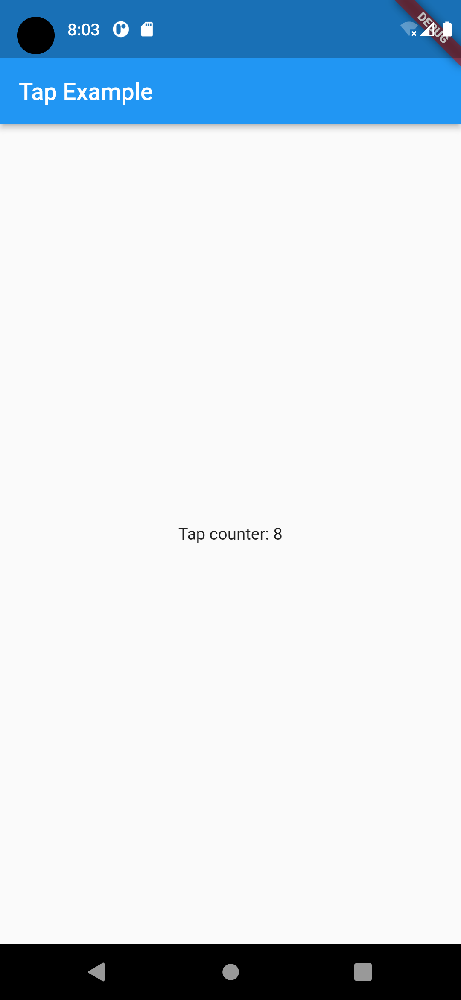
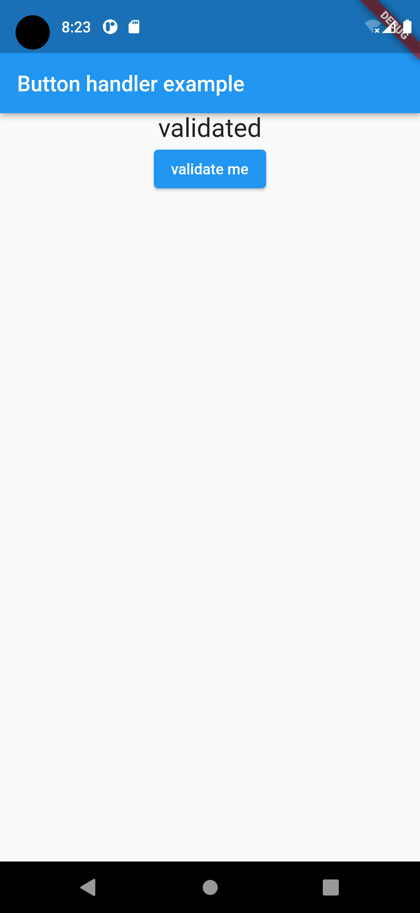

# Flutter for Beginners (2nd ed), Section 2, Chapter 6

- By Thomas Bailey, Alessandro Biessek, Trevor Wills
- October, 2021
- ISBN 978-1-80056-599-9

Section 2: The Flutter User Interface — Everything is a Widget
- Chapter 5: Widgets — Building Layout in Flutter
- Chapter 6: Handling User Input and Gestures
- Chapter 7: Routing — Navigating between Screens

# Chapter 6: Handling User Input and Gestures
- Technical requirements
- Handling user gestures
  - Pointers
  - Gestures
  - GestureDetector
  - Gestures in material widgets
- A deeper look at the stateful widget life cycle
  - Key life cycle states
  - Mounted
- Input widgets and forms
  - Getting input through a controller
  - FormField and TextField
  - Accessing the FormField widget's state
  - Form
- Custom input and FormField widgets
  - Creating custom inputs
  - Custom input widget example

<!--- ///////////////////////////////////////////////////////////////////// --->
## Handling user gestures

The screen events in Flutter's gesture system are separated into two layers:

- Pointer layer: holds the raw data including the location and movement os the pointer.
- Gesture layer: takes multiple pointer actions and tries to assign them some meaning as a user action.

<!--- ================================================================= --->
### Pointers

Generally, there is no need to use events from this layer in your application, but if you need to do some bespoken input handling, then you can use this layer to receive events on every pointer update and decide how to control it.

- `PointerDownEvent`
- `PointerMoveEvent`
- `PointerUpEvent`
- `PointerCancelEvent`

Flutter provide the `Listener` class, which can be used to detect the pointer interaction events listed previously. You can wrap a widget tree with this widget to handle pointer events on its widget subtree.

<!--- ================================================================= --->
### Gestures

The gestures are recognized from multiple pointer events, and even multiple individual pointers (multitouch).

- Tap
- Double-tap
- Press and long-press
- Drag
- Pan
- Scale

Flutter provides the `GestureDetector` widget, which contains callbacks for all of the preceding events.

<!--- ================================================================= --->
### GestureDetector

We have a stateful widget named `MyTap` (#1) and its companion state class, `_MyTapState` (#7). We need to have a state because we want the widget to react to user input, and this will involve changing the value of a variable and then redrawing the widget.

```dart
 1: class MyTap extends StatefulWidget {
 2:   const MyTap({Key? key}) : super(key: key);
 3:   @override
 4:   State<MyTap> createState() => _MyTapState();
 5: }
 6:
 7: class _MyTapState extends State<MyTap> {
 8:   int _counter = 0;
 9:   @override
10:   Widget build(BuildContext context) {
11:     return Scaffold(
12:       appBar: AppBar(
13:         title: const Text('Tap example'),
14:       ),
15:       body: Center(
16:         child: GestureDetector(
17:           onTap: () {
18:             setState(() {
19:               _counter++;
20:             });
21:           },
22:           child: Text(
23:             'Tap counter: $_counter',
24:           ),
25:         ),
26:       ),
27:     );
28:   }
29: }
```



The `GestureDetector` (#16) wraps the child widget (#22-24) and reports on gestures that happen within the child wiget tree.

#### Tap

If you wish to listen to more fine-grained gestures around taps, there are also other constructor parameters:

- `onTapDown`
- `onTapUp`
- `onTapCencel`

#### Double-tap

The code will look very similar to the tap example:

```dart
17:           onDoubleTap: () {
18:             setState(() {
19:               _counter++;
20:             });
21:           },
```

If you wish to listen to more fine-grained gestures around double-taps, there are also other constructor parameters:

- `onDoubleTapDown`
- `onDoubleTapUp`
- `onDoubleTapCencel`

Note that some of the more fine-grained, or partial, gestures may be triggered before the full gesture has been resolved, and therefore not align with correct gesture. For example, `onTapDown` would be triggered on the first tap of a double-tap, but ultimately the tap gester would not complete because the user did a double-tap rather than a single tap.

#### Press and Hold

A press on the device screen is similar to a tap but having contact with the screen for a longer period of time before release and with no movement away from the location.

```dart
17:           onLongPress: () {
18:             setState(() {
19:               _counter++;
20:             });
21:           },
```

If you wish to listen to more fine-grained gestures around long-press, there are also other constructor parameters:

- `onLongPressStart`
- `onLongPressEnd` or `onLongPressUp`
- `onLongPressMoveUpdate`

#### Drag, Pan, and Scale

Drag, pan, and scale gestures are similar to each other, and we have to decide which one to use in each situation, as they cannot all be used together.

- Horizontal drag
  - `onHorizontalDragStart: (DragStartDetails)`
  - `onHorizontalDragUpdate: (DragUpdateDetails)`
  - `onHorizontalDragEnd: (DragEndDetails)`
- Vertical drag
  - `onVertialDragStart: (DragStartDetails)`
  - `onVerticalDragUpdate: (DragUpdateDetails)`
  - `onVerticalDragEnd: (DragEndDetails)`
- Pan
  - `onPanStart` --> to find out the parameters
  - `onPanUpdate`
  - `onPanEnd`
- Scale
  - `onScaleStart: (ScaleStartDetails)`
  - `onScaleUpdate: (ScaleUpdateDetails)`
  - `onScaleEnd: (ScaleEndDetails)`

<!--- ================================================================= --->
### Gestures in material widgets

While `GestureDetector` is a very useful widget, most of the time you will not need to use it because built-in widgets will already have gesture management built into them.
Material Design and iOS Cupertino widgets have many gestures abstracted to a constructor parameter by using the `GestureDetector` widget internally in their code.

For example, material widgets such as `ElevatedButton` embed a special widget named `InkWell` that, in addition to giving access to the tap gesture event, will also create a splash effect on the target widget. The `onPressed` property of `ElevatedButton` exposes the tap functionality that can be used to implement the action to the button.

```dart
 1: class _MyButtonHandlerState extends State<MyButtonHandler> {
 2:   var state = 'to be validated';
 3:   @override
 4:   Widget build(BuildContext context) {
 5:     return Scaffold(
 6:       appBar: AppBar(
 7:         title: const Text('Button handler example'),
 8:       ),
 9:       body: Column(
10:         children: <Widget>[
11:           Center(
12:             child: Text(
13:               state,
14:               style: const TextStyle(fontSize: 24),
15:             ),
16:           ),
17:           ElevatedButton(
18:             onPressed: () {
19:               setState(() {
20:                 state = 'validated';
21:               });
22:             },
23:             child: const Text('validate me'),
24:           ),
25:         ],
26:       ),
27:     );
28:   }
29: }
```



A child widget `Text` widget (#23) is displayed in `ElevatedButton` (#17-24) and a tap on the button is handled by the function passed as the argument to the `onPress` constructor parameter (#18-22).

<!--- ///////////////////////////////////////////////////////////////////// --->
## A deeper look at the stateful widget life cycle

<!--- ================================================================= --->
### Key life cycle states

#### Initializing the State

The instance of `State` can initialize its state variable or other infrastructure requirements (such as database connections) in the `initState()` method. This method is only called once when the widget is added to the widget tree for the first time (that is, it becomes visible to the user) and is optional.

```dart
@override
void initState() {
  super.initState();
  // custom initialization logic here
}
```

#### Build

The `build` method is called when the widget is to be drawn to the screen. It is called after `initState()` and then called every time `setState()` is triggered.

#### Disposing of the the State

When a wodget is removed from the widget tree, the `dispose()` method is called. Any infrastructure clean-ip needed, generally for activities that happened during `initState()`, such as setting up database listeners or internet connections, will be done in the `dispose()` method.

```dart
@override
void dispose() {
  // custom clean-ip code here
  super.dispose();
}
```

<!--- ================================================================= --->
### Mounted

In addition to the life cycle states, there is an important field available to you, from the stateful parent class of your widget, called `mounted`. This will tell you wheter the widget is still mounted onto the widget tree. Specifically, when `initState()` is called, then `mounted` is marked as `true`, and when `dispose()` is called, `mounted` is marked as `false`.

You would use this for situations such as listening on a database or internet connection. If a change is database or internet connection state was coded to trigger an update of thw widget (perhaps through `setState()`), then it is prudent to add a `mounted` check before calling `setState()` as the widget may have been removed from the widget tree between the time you set up the listener and the time it received an update.

```dart
if (mounted) {
  setState(() {
    // change state here
  });
}
```

<!--- ///////////////////////////////////////////////////////////////////// --->
## Input widgets and forms

<!--- ================================================================= --->
### Getting input through a controller

When using a standard `TextFiled` widget, we need to use its `controler` property to access its value. This is done with the `TextEditingController` class:

```dart
 1: class _MyTextEditingState extends State<MyTextEditing> {
 2:   String _textValue = '';
 3:   final _textEditingController = TextEditingController.fromValue(
 4:     const TextEditingValue(text: 'Initial value'),
 5:   );
 6:
 7:   @override
 8:   void initState() {
 9:     super.initState();
10:     _textEditingController.addListener(() {
11:       setState(() {
12:         _textValue = _textEditingController.text;
13:       });
14:     });
15:   }
16:
17:   @override
18:   Widget build(BuildContext context) {
19:     return Scaffold(
20:       appBar: AppBar(
21:         title: const Text('Text editing example'),
22:       ),
23:       body: Column(
24:         children: [
25:           TextField(
26:             controller: _textEditingController,
27:           ),
28:           Text(
29:             'typed as: $_textValue',
30:           ),
31:         ],
32:       ),
33:     );
34:   }
35: }
```

<!--- ================================================================= --->
### FormField and TextField

<!--- ================================================================= --->
### Accessing the FormField widget's state

<!--- ================================================================= --->
### Form

<!--- ///////////////////////////////////////////////////////////////////// --->
## Custom input and FormField widgets

<!--- ================================================================= --->
### Creating custom inputs

<!--- ================================================================= --->
### Custom input widget example
