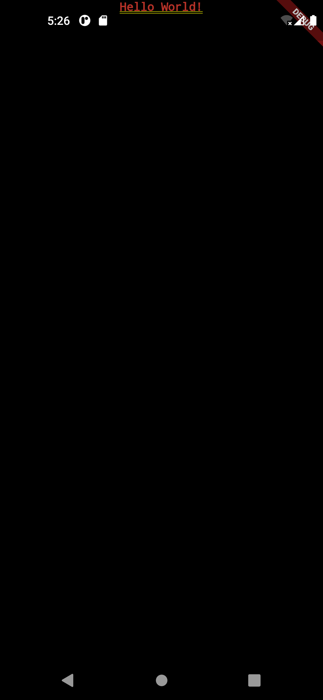
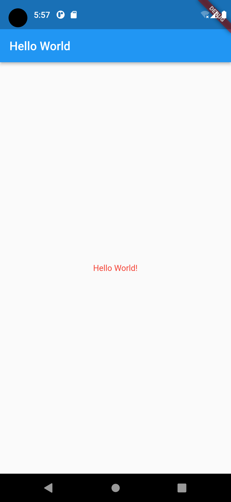

# Flutter for Beginners (2nd ed), Section 2, Chapter 5

- By Thomas Bailey, Alessandro Biessek, Trevor Wills
- October, 2021
- ISBN 978-1-80056-599-9

Section 2: The Flutter User Interface — Everything is a Widget

# Chapter 5: Widgets — Building Layout in Flutter

- Technical requirements
- Stateful/Stateless widgets
  - Stateless widgets
  - Stateful widgets
  - Inherited widgets
  - The widget key property
- Built-in widgets
  - Basic widgets
  - Material Design and iOS Cupertino widgets
  - Layouts
- Streams

<!--- ///////////////////////////////////////////////////////////////////// --->
## Stateful/Stateless widgets

<!--- ================================================================= --->
### Stateless widgets

Stateless widgets do not have a state; that is, they do not change by themselves through an internal action or behavior. Insted, they are changed by external events on parent widgets in the widget tree.

The parent widget instantiates the child stateless widget and passes a set of properties during the instantiation. The child widget can only receive these properties from the parent widget and will not chage them by itself.

In terms of code, this means that stateless widgets only have final properties defined during construction, and these properties can only be changed through the update of a parent widget with the changes then ripping down to the child widgets.

```dart
 1: void main() {
 2:   runApp(const MyApp());
 3: }
 4:
 5: class MyApp extends StatelessWidget {
 6:   @override
 7:   Widget build(BuildContext context) {
 8:     return MaterialApp (
 9:       title: 'Flutter Demo',
10:       theme: ThemeData( ... ),
11:       home: MyHomePage(title: 'Flutter Demo Home Page'),
12:     );
13:   }
14: }
```

`MyApp` (#5) is the root of the widget tree; it is the top-level widget that is instantiated within the `runApp` method (#2) in Dart `main` method. Therefore, it builds all the widgets down the tree. In this example, the direct child is `MaterialApp` (#8).

- `MaterialApp` is defined as *a convenient widget that wraps a number of widgets that are commonly required for material design applications*.
- *Material Design* is a standard set of designs and digital experiences that were created by Google to help teams build high-quality UIs. Apple has an equivalent named *Cupertino*.

`BuildContext` (#7) allows you to access important ancestral information that helps to describe the widget that is being built. For example, the theme data defined in this widget can be accessed by all child widgets to ensure there is a consistent look and feel to your application.

The `home` property (#11) is the first widget that is displayed within your application. The `MyHomePage` is not a built-in widget, but rather a stateful widget defined within the Flutter Demo application.

<!--- ================================================================= --->
### Stateful widgets

By definition, *stateful widgets* are also immutable, but they have a companion `State` class that represents the current state of the widget. ... The `State` object will notify you when the widget needs to be rebuilt and then perform an update in the elements tree, too.

```dart
class MyHomePage extends StatefulWidget {
  const MyHomePage({Key? key, required this.title}) : super(key: key);
  final String title;
  @override
  State<MyHomePage> createState() => _MyHomePageState();
}
```

`MyHomePage` is a statefull widget, and so, it is defined with a `State` object named `_MyHomePageState`, which contains properties that affect how the widget looks. ... Stateful widgets must override the `createState()` method an instance of the companion object.

A valid widget state is a class that extends the framework `State` class, which is defined as: *The logic and internal state for a StatefulWidget."

```dart
 1: class _MyHomePageState extends State<MyHomePage> {
 2:   int _counter = 0;
 3:   id _incrementCounter() {
 4:     setState(() {
 5:       _counter++;
 6:     });
 7:   }
 8:   @override
 9:   Widget build(BuildContext context) {
10:     return Scaffold(
11:       appBar: AppBar(
12:         title: Text(widget.title),
13:       ),
14:       body: Center(
15:         child: Column(
16:           mainAxisAlignment: MainAxisAlignment.center,
17:           children: <Widget>[
18:             const Text(
19:               'You have pushed the button this many times:',
20:             ),
21:             Text(
22:               '$_counter',
23:               style: Theme.of(context).textTheme.headline4,
24:             ),
25:           ],
26:         ),
27:       ),
28:       floatingActionButton: FloatingActionButton(
29:         onPressed: _incrementCounter,
30:         tooltip: 'Increment',
31:         child: const Icon(Icons.add),
32:       ),
33:     );
34:   }
35: }
```

First, there is only one class field, which is named `_counter` (#2), so you can infer that the state of the `MyHomePage` widget is defined by that single property.

A stateful widgets is meant to change its appearance during its lifetime — that is, it defines what will change — and so it needs to be rebuilt to reflect changes. The `setSate` method (#4) receives a function as a parameter that updates the corresponding `State`. By calling `setState`, the framework is notified that it needs to rebuild the widget. Once called, the widget will be redrawn the new `_counter` value already set.

The `build` method returns a `Scaffold` widget at the top level and is composed of three child widgets via three constructor arguments:

- `appBar`
- `body`
- `floatingActionButton`

Note that one of the arguments for the `FloatingActionButton` constructor is `onPressed`, and that the value is the `_incrementCounter` method. This tie the whole flow together.

<!--- ================================================================= --->
### Inherited widgets

The `InheritedWidget` class is an auxiliary kind of widget that helps to propagate information down the tree.

By adding an `InheritedWidget` to the tree, any widget below it can access the data it exposes by using the `of(InheritedWidget)` method of the `BuildContext` class that receives an `InheritedWidget` type as a parameter and uses the tree to find the first ancestral widget of the requested type.

One of the most common uses of `InheritedWidget` is from the `Theme` class, which helps to describe colors for a whole application.

<!--- ================================================================= --->
<!--- ### The widget key property --->

<!--- ///////////////////////////////////////////////////////////////////// --->
## Built-in widgets

<!--- ================================================================= --->
### Basic widgets

#### The `Text` widget

```dart
main.dart
 1: void main() {
 2:   runApp(const MyApp());
 3: }
 4:
 5: class MyApp extends StatelessWidget {
 6:   @override
 7:   Widget build(BuildContext context) {
 8:     return MaterialApp (
 9:       title: 'Flutter Demo',
10:       theme: ThemeData( ... ),
11:       home: const MyText(),
12:     );
13:   }
14: }

text.dart
 1: import 'package:flutter/material.dart';
 2:
 3: class MyText extends StatelessWidget {
 4:   const MyText({Key? key}) : super(key: key);
 5:   @override
 6:   Widget build(BuildContext context) {
 7:     return const Text(
 8:       'Hello World!',
 9:       style: TextStyle(color: Colors.red, fontSize: 14),
10:       textAlign: TextAlign.center,
11:     );
12:   }
13: }
```

The preceding code renders the text as follows:



With the `Scaffold` widget, you have a better look.

```dart
 3: class MyText extends StatelessWidget {
 4:   const MyText({Key? key}) : super(key: key);
 5:   @override
 6:   Widget build(BuildContext context) {
 7:     return Scaffold(
 8:       appBar: AppBar(
 9:         title: const Text('Hello World'),
10:       ),
11:       body: Center(
12:         child: Column(
13:           mainAxisAlignment: MainAxisAlignment.center,
14:           children: const <Widget>[
15:             Text(
16:               'Hello World!',
17:               style: TextStyle(color: Colors.red, fontSize: 14),
18:             ),
19:           ],
20:         ),
21:       ),
22:     );
23:   }
24: }
```



<!--- ================================================================= --->
### Material Design and iOS Cupertino widgets

<!--- ================================================================= --->
### Layouts

<!--- ///////////////////////////////////////////////////////////////////// --->
## Streams

