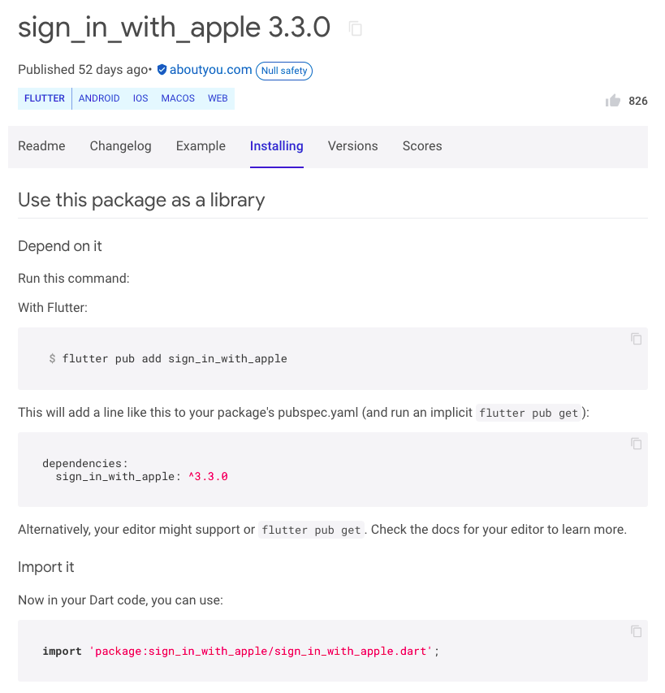

# Flutter for Beginners (2nd ed), Section 3, Chapter 8

- By Thomas Bailey, Alessandro Biessek, Trevor Wills
- October, 2021
- ISBN 978-1-80056-599-9

Section 3: Developing Fully Featured Apps

# Chapter 8: Plugins — What Are They and How Do I Use Them?

- What is a plugin?
  - Benefits
  - Drawbacks
- Where can I find plugins?
- How do I add a plugin to my project?
  - The `pubsepec.yaml` file
  - The `flutter pub` command
  - Using a plugin in your code
- How do plugins work on iOS and Android?
  - The `MethodChannel` class
  - The `CocoaPods` dependency manager
  - Gradle
- Common issues
  - Plugin breaking change
  - Plugin not working
  - PR not merged
  - Inconsistent dependencies
  - `MissingPluginException`

<!--- //////////////////////////////////////////////////////////////////////////////////////// --->
## What is a plugin?

Within this chapter, you will see references to the term *packages*, a chunk of Dart code, and *assets*. A plugin is a special type of package that makes functionality available to your app and this is what we are looking at in this chapter.

<!--- ================================================================= --->
### Benefits

- code reuse
- many eyes
- low-level integration

It is almost impossible to test your code on all the different devices out there, all the different screen ratios, or used in all the weird and wonderful ways that users manage to find. Plugin code is effectively tested for free across devices, screen ratios, and usage patterns.

For some functionality, you will need to integrate with the base operating system (OS) of the device. This could require Java, Swift, JavaScript, or some other language that can interface with the OS, and unless you are proficient in those languages and also knowledgeable about the APIs available within the OS, this could be quite a challenge. Plugins take care of that need to understand low-level integration.

<!--- ================================================================= --->
### Drawbacks

- version management
- difficult to diagnose bugs
- breaking changes

Like any good plugin system, all plugins in Flutter are versioned using the semantic versioning scheme. This means it is easy to manage which version of a plugin you are using, and ensure that you have the latest or best (not always the same) version of the plugin for your app.

However, with any versioning system, there is the potential for incompatibility, especially when you have a large number of inter-dependent plugins. This can cause problems, and in rare cases, block you from releasing your app.

The plugin developer will create a new version of the plugin with the major version incremented and warn developers of the change. You don't have to take the new version of the plugin, but the developer is unlikely to maintain older versions, so it is preferable to stay on the latest version so that you can receive any bug fixes.

This can sometimes have a large impact on your code, especially if you rely heavily on that plugin.

<!--- //////////////////////////////////////////////////////////////////////////////////////// --->
## Where can I find plugins?

Flutter has a very easy way to find the plugins that you may need via the https://pub.dev site that they maintain. This is where all plugins are registered and the primary way that developers find plugins.

This site not only allows you to search for plugins but also includes useful sections such as the following:

- Flutter favorites
- Most popular packages
- Package of the week

**Flutter Favorites** are the packages that demonstrate the highest levels of quality, selected by the Flutter Ecosystem Committee.

For each package, this site displays [three scoring dimensions](https://pub.dev/help/scoring). These are displayed in search results, in the sidebar on individual package pages, and in full detail in the scoring report on the 'Scores' tag of an individual package. The three dimensions are:

- Likes: A measure of how many developers have liked a package. This provides a raw measure of the overall sentiment of a package from peer developers.
- Pub Points: A new measure of quality. This includes several dimensions of quality such as code style, platform support, and maintainability. More about this below.
- Popularity: A measure of how many developers use a package, providing insight into what other developers are using.

**Pub Points** is pub.dev's measure of quality. Pub points are awarded in five categories:

- Follow Dart file conventions
- Provide documentation
- Support multiple platforms
- Pass static analysis
- Support up-to-date dependencies

<!--- //////////////////////////////////////////////////////////////////////////////////////// --->
## How do I add a plugin to my project?

It is crucially important that you read the readme fully because for some plugins, there can be platform-specific configuration that you need to set up before the plugin will run. We saw above the readme for this plugin, but let's look at the Installing section now.



<!--- ================================================================= --->
### The `pubsepec.yaml` file

The pubspec.yaml file is where dependencies and assets are configured. There is a specific section called dependencies that holds information about plugins that your project depends on.

```yaml
dependencies:
  flutter:
    sdk: flutter

  # The following adds the Cupertino Icons font to your application.
  # Use with the CupertinoIcons class for iOS style icons.
  cupertino_icons: ^1.0.2
```

You may have noticed the `^` character before the version number. This specifies that you are happy to receive any patch version updates to the plugin. For example, if you specify version `2.1.0`, then only version `2.1.0` will be used by you and any other developers that are using this source code. If you specify version `^2.1.0`, then any version `2.1.x` where `x >= 0` can be used. This means you will automatically receive patch updates (when you download the plugin).

<!--- ================================================================= --->
### The `flutter pub` command

The plugin isn't yet downloaded and available to your project. To do this, we will use a very useful command called `flutter pub`, which is used to manage plugins.

#### `flutter pub get`

This command will read through all the dependencies in `pubspec.yaml`, retrieve the relevant plugins from `pub.dev`, and download them to a central repository on your computer, ready for your project to access it.

#### `flutter pub outdated`

This command will check whether any of your dependencies have newer versions that you may want to upgrade to.
If the command shows that there are newer dependencies, then you will first need to understand what the changes are, by going to `pub.dev` and reading the changelog. Then, you can update `pubspec.yaml` to specify the new version, and finally run `flutter pub get` to download the latest version to your computer.

#### `flutter pub upgrade`

It was mentioned earlier that the version can include the `^` symbol to specify that you are happy to receive patch updates. These patch updates do not magically appear on your computer; you still need to tell Flutter to retrieve the updates. You can do this with the `flutter pub upgrade` command. It is much like `flutter pub get`, but you give it permission to get the latest plugins within the constraints of the versions specified in `pubspec.yaml`.

<!--- ================================================================= --->
### Using a plugin in your code

Now that the plugin code has been downloaded to your computer, and you have specified that your project depends on that plugin, the next step is to import the code into the classes where you need it.

You may have a shortcut in your IDE that allows you to generate the stateless widget code. Try typing `stless` and see if the IDE gives you any hints. If it does, set the widget name to `RedTextWidget`.

You may notice that there are errors on the page. This is because you need to add an import statement. In isolation, the class name `StatelessWidget` doesn't exist, it isn't within the same Dart file, so the compiler has no idea what it is.

We need to add the same import that we saw on the `main.dart` file to import all the standard Flutter framework classes, so at the very top, add the following; The errors disappeared. You now have a stateless widget that returns an empty `Container` widget from the `build` method.

```dart
 1: import 'package:flutter/material.dart';
 2:
 3: class RedTextWidget extends StatelessWidget {
 4:   const RedTextWidget({Key? key}) : super(key: key);
 5:
 6:   @override
 7:   Widget build(BuildContext context) {
 8:     return Container();
 9:   }
10: }
```

Let's add a constructor parameter that takes a `String` named `text`. We will pass the contents of this parameter down to the `AutoSizeText` widget when we add it.

```dart
 1: import 'package:flutter/material.dart';
 2:
 3: class RedTextWidget extends StatelessWidget {
 4:   final String text;
 5:   const RedTextWidget({Key? key, required this.text}) : super(key: key);
 6:
 7:   @override
 8:   Widget build(BuildContext context) {
 9:     return Container();
10:   }
11: }
```

#### Using the plugin

```dart
import 'package:flutter/material.dart';
import 'package:auto_size_text/auto_size_text.dart';

void main() {
  runApp(const MyApp());
}

class MyApp extends StatelessWidget {
  const MyApp({Key? key}) : super(key: key);

  @override
  Widget build(BuildContext context) {
    return MaterialApp(
      title: 'Flutter Demo',
      theme: ThemeData(
        primarySwatch: Colors.blue,
      ),
      home: Scaffold(
        appBar: AppBar(
          title: const Text('Hello plugin'),
        ),
        body: Center(
          child: Column(
            children: const [
              RedTextWidget(
                  text: 'You have pushed the button this many times:'),
            ],
          ),
        ),
      ),
    );
  }
}

class RedTextWidget extends StatelessWidget {
  final String text;
  const RedTextWidget({Key? key, required this.text}) : super(key: key);

  @override
  Widget build(BuildContext context) {
    return AutoSizeText(
      text,
      style: const TextStyle(color: Colors.red),
    );
  }
}
```

<!--- //////////////////////////////////////////////////////////////////////////////////////// --->
## How do plugins work on iOS and Android?

Many plugins will work with the different underlying platforms to use operating system functionality.

<!--- ================================================================= --->
### The `MethodChannel` class

Flutter communication between the client (Flutter) and the host (native) application occurs through platform channels. The `MethodChannel` class is responsible for sending messages (method invocations) to the platform side.

```
$ flutter pub add device_info_plus
Downloading device_info_plus 3.2.1...
Downloading device_info_plus_windows 2.1.1...
Downloading device_info_plus_web 2.1.0...
Downloading device_info_plus_macos 2.2.1...
Downloading device_info_plus_linux 2.1.1...
Downloading device_info_plus_platform_interface 2.3.0+1...
Downloading ffi 1.1.2...
Downloading plugin_platform_interface 2.1.2...
Downloading win32 2.3.6...
```

Take a look at the `pubspec.yaml` file and you will see that the `device_info_plus` plugin has been added within the `dependencies` section. Also, the `flutter pub get` has automatically been run to pull the Flutter code into your project. However, you do not yet have the native code available.

If you run (or build) the project, Flutter will automatically retrieve the native code dependencies. These are managed by **CocoaPods** in iOS and **Gradle** in Android.

<!--- ================================================================= --->
### `CocoaPods`

For iOS native code libraries, Flutter uses the `CocoaPods` dependency manager. Flutter plugins that need iOS native code will specify a dependency on a CocoaPods library and the CocoaPods dependency manager will download the relevant library at the correct version and include it in your iOS build.

After you have run your project on an iOS emulator or device, you may notice that there is a file that has appeared within the iOS folder within your project files. This is called `PodFile` and manages your CocoaPods dependencies.

When you run or build your project, the CocoaPods dependency manager is invoked by calling the `pod install` command within the `ios` folder. All the dependencies are retrieved at the correct versions for your project.

```
$ flutter run lib/ch08/device_info.dart -d 'iPhone 12'         
Launching lib/ch08/device_info.dart on iPhone 12 in debug mode...
Running pod install...                                              4.3s
Running Xcode build...                                                  
 └─Compiling, linking and signing...                        39.6s
Xcode build done.                                           75.3s
Syncing files to device iPhone 12...                               104ms
```

<!--- ================================================================= --->
### Gradle

Building and running Flutter apps on Android uses the Gradle build automation tool. You can explore some of the files in the `android` folder, but the ones that you will occasionally need to change to configure plugins will be the following:

- `android/build.gradle`
- `android/app/build.gradle`

These files manage the build process and dependencies that your project needs, and occasionally some manipulation of versions or build flow is needed for a plugin to work correctly.

<!--- //////////////////////////////////////////////////////////////////////////////////////// --->
## Common issues

- Plugin breaking change
- Plugin not working
- PR not merged
- Inconsistent dependencies
- `MissingPluginException`
