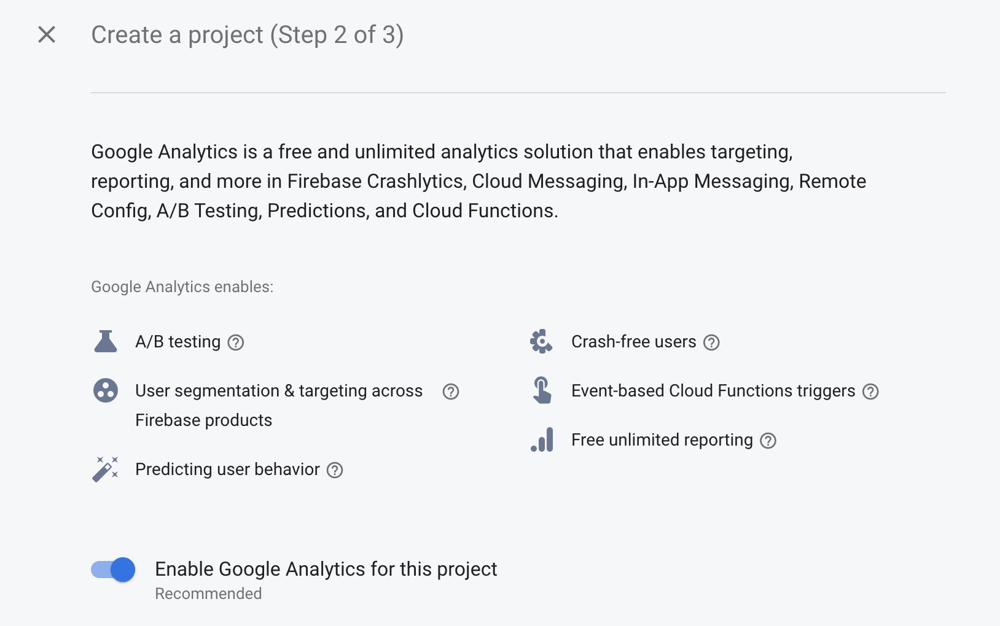
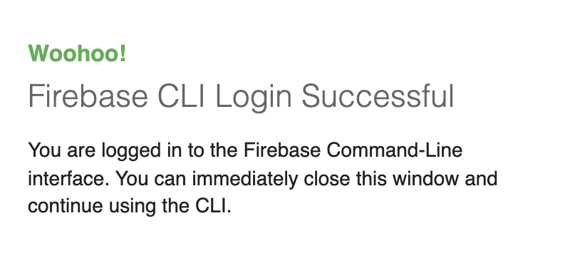

# Flutter for Beginners (2nd ed), Section 3, Chapter 8

- By Thomas Bailey, Alessandro Biessek, Trevor Wills
- October, 2021
- ISBN 978-1-80056-599-9

Section 3: Developing Fully Featured Apps

# Chapter 9: Popular Third-Party Plugins

- Exploring Firebase plugins
  - Firebase registration
  - Connecting the Flutter app to Firebase
  - FlutterFire plugins
  - Firebase initialization
  - Authentication
  - Realtime Database
  - Firestore
  - Analytics and Crashlytics
  - Cloud Storage
  - Cloud Functions
  - ML with Firebase ML Kit
  - Messaging
- Understanding Google Maps and Places
- Exploring mobile device features
  - Camera and QR codes
  - Opening web pages
  - Local storage
  - Video
  - Payment providers
  - In-app purchases
  - Opening files
- Plugins to help with your app support
  - App version
  - Device information

## Understand Firebase projects

[Firebase](https://firebase.google.com/docs/projects/learn-more) is a set of services available on Google Cloud that you can use to create apps with advanced features.

When you create a new Firebase project in the Firebase console, you're actually creating a Google Cloud project behind the scenes. You can think of a Google Cloud project as a virtual container for data, code, configuration, and services. A Firebase project is a Google Cloud project that has additional Firebase-specific configurations and services. You can even create a Google Cloud project first, then add Firebase to the project later.

Since a Firebase project is a Google Cloud project:

- Projects that appear in the Firebase console also appear in the Google Cloud Console and Google APIs console.
- Billing and permissions for projects are shared across Firebase and Google Cloud.
- Unique identifiers for a project (like the project number and the project ID) are shared across Firebase and Google Cloud.
- You can use products and APIs from both Firebase and Google Cloud in a project.
- Deleting a project deletes it across Firebase and Google Cloud.

<!--- //////////////////////////////////////////////////////////////////////////////////////// --->
## Exploring Firebase plugins

- Realtime Data
- Cloud Firestore
- Cloud Functions
- Performance Monitoring
- Authentication
- Firebase Cloud Messaging
- AdMob
- Machine Learning Kit

**Realtime Database** is a NoSQL (non-relational) database on the cloud. With this, you can store and access data in real time. **Cloud Firestore** is a NoSQL database, with a focus on big and scalable applications that provide advanced query support compared to a real-time database. **AdMob** displays advertisements to monetize applications.

<!--- ================================================================= --->
### Firebase registration

All of the Firebase services are managed from one dashboard or console, and you will need to set up your Firebase access and then register your app before you can use the services. Once you have a project created, you will then be able to register apps to the project.



Once you have created the first Firebase project, you will get a welcome mail from Firebase.


The welcome mail as of January 2022 suggested the following technologies as next steps:

- **Hosting**: Deploy fast-loading, secure websites that are backed by a global CDN without all of the hassle
- **Cloud Firestore**: Build serverless, secure apps at global scale. Store app data in the cloud, sync data across online and offline devices, and retrieve it with expressive queries.
- **Realtime Database**: Build serverless apps by storing and syncing JSON data between your users in near-realtime, on or offline, with strong user-based security.
- **Authentication**: Add and end-to-end identity solution to your app for easy user authentication, sign-in, and onboarding in just a few lines of code.

<!--- ================================================================= --->
### Connecting the Flutter app to Firebase

It is possible to configure multiple applications from multiple platforms to connect with a Firebase project. On the Firebase project page, we have an option to add apps for iOS, Android, and the web.

Let's go ahead and register the Hello World app for both Android and iOS, in preparation for some of the Firebase service tinkering we will be doing later.

#### Android

[Manual installation](https://firebase.flutter.dev/docs/manual-installation/) is not the recommended installation flow. These guides are for existing applications using FlutterFire.

In previous versions of FlutterFire, in order to add Firebase to your projects manual platform specific steps were required, such as downloading a `google-services.json` file for Android, downloading a `GoogleService-Info.plist` file for iOS or editing your `index.html` file for web.

FlutterFire now supports [initialization from Dart](https://firebase.flutter.dev/docs/overview#initializing-flutterfire) using the [FlutterFire CLI](https://firebase.flutter.dev/docs/manual-installation/cli).

- Package name
  - You can find the package name of your Android app in the `android/app/build.gradle` file, within the `applicationId` property.
  - `applicationId "com.example.myapp"`
- `google-services.json`
  - After completing registration, a `google-services.json` file is generated that has all the information your app will need to be able to access your project on Firebase. This should be added to your application project in the `android/app` directory.
- Project-level build.gradle (`myapp/android/build.gradle`):
```yaml
buildscript {
  dependencies {
    // Add this line
    classpath 'com.google.gms:google-services:4.3.10'
  }
}
```
- App-level build.gradle (`myapp/android/app/build.gradle`):
```yaml
// Add this line
apply plugin: 'com.google.gms.google-services'

dependencies {
  // Add these lines
  implementation platform('com.google.firebase:firebase-bom:29.0.3')
  implementation 'com.google.firebase:firebase-analytics-ktx'
}
```

If you wish to [migrate](https://firebase.flutter.dev/docs/manual-installation/#migrating-to-dart-only-initialization) to the Dart-only initialization flow, some steps are required for your existing applications.

1. Remove the `/android/app/google-services.json` file.
2. Remove the `google-services` dependency from the `/android/build.gradle` file:
```yaml
 buildscript {
   dependencies {
     // ... other dependencies
-    classpath 'com.google.gms:google-services:4.3.8'
   }
 }
```
3. Remove the plugin execution via the `/android/app/build.gradle` file:
```yaml
- apply plugin: 'com.google.gms.google-services'

dependencies {
  // Add these lines
- implementation platform('com.google.firebase:firebase-bom:29.0.3')
- implementation 'com.google.firebase:firebase-analytics-ktx'
}
```

#### iOS
<!--- ================================================================= --->
### FlutterFire plugins

[FlutterFire](https://firebase.flutter.dev/docs/overview/) is a set of Flutter plugins which connect your Flutter application to Firebase.

Before any Firebase services can be used, you must first install the `firebase_core` plugin, which is responsible for connecting your application to Firebase.

Install the plugin by running the following command from the project root:

```
$ flutter pub add firebase_core
Downloading firebase_core 1.11.0...
Downloading firebase_core_web 1.5.3...
Downloading firebase_core_platform_interface 4.2.3...
Changed 3 dependencies!
```

<!--- ================================================================= --->
### Firebase initialization

️FlutterFire now supports [initialization directly from Dart](️FlutterFire now supports initialization directly from Dart)

Before any of the Firebase services can be used, FlutterFire needs to be initialized (you can think of this process as FlutterFire "bootstrapping" itself). The initialization step is asynchronous, meaning you'll need to prevent any FlutterFire related usage until the initialization is completed.

To initialize FlutterFire, call the `initializeApp` method on the `Firebase` class. The method accepts your Firebase project application configuration, which can be obtained for all supported platforms by using the FlutterFire CLI:

```
$ dart pub global activate flutterfire_cli
Downloading flutterfire_cli 0.1.1+2...
Downloading xml 5.3.1...
Downloading pubspec 2.0.1...
Downloading interact 2.1.1...
Downloading deep_pick 0.10.0...
Downloading cli_util 0.3.5...
Downloading uri 1.0.0...
Downloading tint 2.0.0...
Downloading platform 3.1.0...
Downloading petitparser 4.4.0...
Downloading pub_semver 2.1.0...
Downloading dart_console 1.0.0...
Downloading matcher 0.12.11...
Downloading source_span 1.8.2...
Downloading quiver 3.0.1+1...
Downloading ansi_styles 0.3.1...
Downloading ffi 1.1.2...
Downloading win32 2.3.6...
Building package executables... (3.6s)
Built flutterfire_cli:flutterfire.
Installed executable flutterfire.
Warning: Pub installs executables into $HOME/.pub-cache/bin, which is not on your path.
You can fix that by adding this to your shell's config file (.bashrc, .bash_profile, etc.):
  export PATH="$PATH":"$HOME/.pub-cache/bin"
Activated flutterfire_cli 0.1.1+2.
```

As of Janurary 2022, the FlutterFire CLI requires the official Firebase CLI to also be installed.

```
$ $HOME/.pub-cache/bin/flutterfire configure
ERROR: The FlutterFire CLI currently requires the official Firebase CLI to also be installed
```

So, let's [install the CLI](https://firebase.google.com/docs/cli#install_the_firebase_cli):

```
$ curl -sL https://firebase.tools | bash
```

This script automatically detects your operating system, downloads the latest Firebase CLI release, then enables the globally available firebase command.

After installing the CLI, you must authenticate.

```
$ firebase login
```



```
✔  Success! Logged in as toshiro.en.miyamoto@gmail.com
```

Then you can confirm authentication by listing your Firebase projects.

```
$ firebase projects:list
Project Display Name  Project ID           Project Number  Resource Location ID
Hello Flutter         hello-flutter-xxxxx  9609xxxx3532    [Not specified]
1 project(s) total.
```

Configure Firebase for your Flutter app. This command will fetch Firebase configuration for you and generate a Dart file with prefilled `FirebaseOptions` you can use.

```
$HOME/.pub-cache/bin/flutterfire configure
i Found 1 Firebase projects.
✔ Select a Firebase project to configure your Flutter application with · hello-flutter-b20a5 (Hello Flutter) 
✔ Which platforms should your configuration support (use arrow keys & space to select)? · android, ios, web 
i Firebase android app com.example.myapp is already registered.
✔ Which ios bundle id do you want to use for this configuration, e.g. 'com.example.app'? · com.example 
i Firebase ios app com.example is not registered on Firebase project hello-flutter-b20a5.
i Registered a new Firebase ios app on Firebase project hello-flutter-b20a5.
i Firebase web app myapp (web) is not registered on Firebase project hello-flutter-b20a5.
i Registered a new Firebase web app on Firebase project hello-flutter-b20a5.

Firebase configuration file lib/firebase_options.dart generated successfully with the following Firebase apps:

Platform  Firebase App Id
web       1:960929733532:web:59a9ac7c49cec2dfd90659
android   1:960929733532:android:cc150025e51bc3ded90659
ios       1:960929733532:ios:50dfa4d8da29f79ed90659
```

Once configured, a `firebase_options.dart` file will be generated for you containing all the options required for initialization.

Next the generated options need to be provided to the `initializeApp` method. Since this is an asynchronous operation, the `main` function can be modified to ensure initialization is complete before running the application.

```dart
import 'package:firebase_core/firebase_core.dart';
import 'firebase_options.dart';

void main() async {
  WidgetsFlutterBinding.ensureInitialized();
  await Firebase.initializeApp(
    options: DefaultFirebaseOptions.currentPlatform,
  );
  runApp(MyApp());
}
```

<!--- ================================================================= --->
### Authentication

Firebase Authentication allows you to secure access to your application and other Firebase services through a login/register process. To make this as easy as possible for your users, Firebase Authentication enables the use of multiple authentication options, such as email/password, phone authentication, and federated identity providers (IdPs) such as Google, Apple, Twitter, and Facebook.

The Flutter plugin that is supported by the Firebase team is firebase_auth. You can see the author in pub.dev by viewing the publisher details.

#### Setup

```
$ flutter pub add firebase_auth
Resolving dependencies...
+ http_parser 4.0.0
+ intl 0.17.0
Downloading firebase_auth 3.3.5...
Downloading firebase_auth_web 3.3.6...
Downloading firebase_auth_platform_interface 6.1.10...
Changed 5 dependencies!
```

```dart
FirebaseAuth auth = FirebaseAuth.instance;
```

#### `authStateChanges` stream
#### Sign-in
<!--- ================================================================= --->
### Realtime Database
#### Setup
#### Data manipulation
#### Security
<!--- ================================================================= --->
### Firestore
#### Setup
#### Data manipulation
#### Security
<!--- ================================================================= --->
### Analytics and Crashlytics
#### Crashes
#### Analytics
<!--- ================================================================= --->
### Cloud Storage
#### AdMob
<!--- ================================================================= --->
### Cloud Functions
<!--- ================================================================= --->
### ML with Firebase ML Kit
<!--- ================================================================= --->
### Messaging

<!--- //////////////////////////////////////////////////////////////////////////////////////// --->
## Understanding Google Maps and Places

<!--- //////////////////////////////////////////////////////////////////////////////////////// --->
## Exploring mobile device features
<!--- ================================================================= --->
### Camera and QR codes
<!--- ================================================================= --->
### Opening web pages
<!--- ================================================================= --->
### Local storage
<!--- ================================================================= --->
### Video
<!--- ================================================================= --->
### Payment providers
<!--- ================================================================= --->
### In-app purchases
<!--- ================================================================= --->
### Opening files

<!--- //////////////////////////////////////////////////////////////////////////////////////// --->
## Plugins to help with your app support
<!--- ================================================================= --->
### App version
<!--- ================================================================= --->
### Device information


